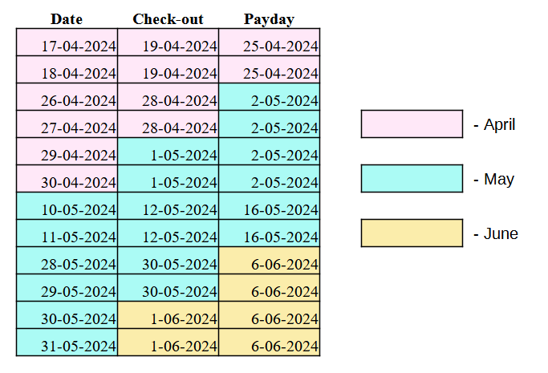

## **Table of Content**
1. [Introduction](#introduction)
2. [How are the money processed?](#how-are-the-money-processed)
    * [Hosting platform](#hosting-platform)
        * [Price Rate](#price-rate)
        * [Discounts](#discounts)
        * [Commission and transaction fee](#commission-and-transaction-fee)
        * [Paycheck](#paycheck)
    * [Expenses](#expenses)
        * [Shopping]()
        * [Apartment Bills]()
        * [Company Fees]()
    * [Statutory Obligations](#statutory-obligations)
        * [VAT](#vat)
        * [Insurance](#insurance)
        * [Income Tax](#tax-base-and-income-tax)
    * [Financial Calculations for Price Breakdown](#financial-calculations-for-price-breakdown)
    * [Settlement](#settlement)
        * [VAT Settlement]()
        * [Income Tax and Net Profit]()
3. [Description for the program's user - Modules](#description-for-the-programs-user---modules)
    * [Guest Table Module](#guest-table-modules)
    * [Expenses Module](#expenses-module)
    * [Settlement Module](#settlement-module)
    * [Data Analysis Module](#data-analysis-module)
4. [The Backend Code](#the-backend-code)
    * [utils](#utils)
    * [routes](#routes)

## **Introduction**

Running a business is inherently tied to managing finances. Every entrepreneur experiences the movement of money — it must be earned to sustain the company, but it also needs to be spent. The primary purpose of accounting for a company's finances is to determine whether, at the end of any given period — be it a month, a year, or another timeframe — the business is operating at a profit or loss.

The specific way a company generates income depends largely on its business model. This program is designed to assist a rental company, an example of a business that has a limited inventory of goods to sell. In the case of a rental business, income is generated by renting out rooms or apartments. For simplicity, this project assumes the company operates a single apartment available for rent. The maximum number of rental nights is determined by the number of rooms (in this case, one) multiplied by the number of nights in a month.

To effectively manage finances, it is essential to keep track of every detail regarding rented nights and associated transactions. This program is built under the assumption that the rental company uses a third-party hosting platform to promote the property. These platforms can help increase visibility and drive bookings but also introduce added complexities—such as commissions, discounts, and different fee structures—that make settlements more intricate.

To keep things straightforward, this program focuses on a single hosting platform, avoiding the redundancy and complexity of explaining varying policies across multiple platforms. The chosen example for this project is Booking.com, which serves as a representative model for illustrating how commissions, discounts, and other platform fees affect overall financial management.

By using this program, a rental company can better track its earnings, expenses, and key financial indicators, simplifying the accounting process and providing a clearer picture of overall business performance.

## **How are the money processed?**

### **Hosting Platform**

The revenue’s potential depends on the price rate we set on the hosting platform, which is bonded to discounts we apply and commission we need to pay to the platform. That’s why the first described section is the description of the policies of the cooperation with the hosting platform.

#### **Price Rate**

Standard price rates may differ between each other within different days of the month. The standard rate for a specific day depends on the likelihood of the occurence of booking or potential amount of people willing to make a reservation on a given day. The standard rate is set directly from a calendar or falls under so called *dynamic pricing* and is set by an algorithm. Either way, the standard price will differ within days in the reservations. 

The price rate is also affected by the number of people included in the reservation, which needs to be connected with a multiplier. 
There are two main strategies of setting the multipliers: **integer multipliers** or **fractional multipliers**. The differences in how rental places choose the strategy depends on factors such as target market, operational costs, and perceived value of the rental space. In case of one apartment, main sources of expenses are fixed because they are independent from the number of guests per reservation (fixed cost of maintaining and preparing the room being similar whether one or two people are staying), which are for example payment for rent, amenities. Accommodating an additional person doesn't contribute to the total price, therefore the price don’t scale linearly with the number of occupants and the most suitable strategy would be a fractional multiplier.

Standard price will be set for two people. If only one person is staying at the apartment, the rate will be reduced by 10%, which gives a multiplier of 0.9. In case of one additional person, they multiplier applied will be 1.1.

#### **Discounts**
One way to encourage guests to visit the apartment is to offer discounts. There are numerous discounts on Booking, and it's important to be aware of how they combine within each other. There are four basic categories of discounts:
  * Rate Plans (e.g. *Flexible rate*, *Non-refundable rate*)
  * Genius Discount (e.g. *Multi-level Discounts*, *Dynamic Pricing*)
  * targeted rates (e.g. *Business Bookers*, *Mobile Rates*)
  * promotions (e.g. *Early Booker Deal*, *Last Minute Deal*, *Deal of the Day*)

  In the following project will be used two categories of discounts: **Genius discounts** and **Promotions**. 

  Genius Discounts are available for objects and guests who belong to the Genius Loyalty Program. The amount of discounts the object will apply depends solely on the owner decision. However, a guest receives an access to next levels of the Genius Discount along with the Genius level (which is depends on the number of reservations made). The discount for the first level is 10%, for the second level is 15%, and for the third - 20%. If an owner decides to switch on the Genius Dynamic Pricing, the discount rate depends on the algorithm decision and is up to 25%. The discount rate offered within the dynamic pricing doesn't depend on the Genius level.

Promotions don't combine with each other, but combine with the discounts from the Genius Program. The promotion applied to the reservation is the one with the highest percentage among all the discounts rate possible. Promotions usually comnine with the Genius discounts, except for the promotion called *Deal of the Day*, which is significantly greater and therefore is used alone.

  
  
  
<strong>Figure 1:</strong> The chart shows whether the chosen discounts can combined or not

#### **Commission and Transaction Fee**
The price paid by a guest who uses Booking consist of part for the owner of the object, and the Booking's commission. The commission is at least 15% and can be rised up to 30%. Along with the increase in the amount of the commission, our object is promoted stronger by Booking.

The transaction fee has been increased in October 2024 to 1,4%. However, before this month the transaction fee was 1,2% - this is the percentage that will be included until October 2024.

#### **Paycheck**

The total price of the reservation is based on the standard price, number of people, the discounts applied, and number of nights. Certain conditions might vary for different days within one reservation. 

Each owner of the object chooses the method of receiving the payment. The two options are: direct payment from guests to the owner or payment handled by Booking.com. For the current project, the chosen way of receiving the payment is by Booking. In this method Booking receives payment directly from the guests, processes it, and sends paychecks to the owner of the object. The paycheck is reduced by the transaction fee and commission included, which rate is between 15% and 30%. It is received in the next Thursday after the check-out of the guest.

### **Expenses**

In order to generate income, the company inevitably incurs expenses. The ratio of income to expenses depends on the company's business model. Companies in sectors that rely on people's skills and knowledge tend to have fewer expenses and a higher income-to-expense ratio. Conversely, businesses in other sectors need to spend on goods and services to maintain their operations. The rental business falls into this latter category, where significant spending is required to maintain it.

While high expenses can indeed reduce overall profit, they also provide financial benefits by reducing VAT and income tax obligations. VAT paid on business-related purchases can be deducted from the VAT that must be submitted to the tax authorities, and income tax is reduced by deducting eligible expenses from total revenue. It’s important to mention that only expenses supported by valid receipts or invoices can be used for these tax reductions.

Keeping track of expenses is crucial to understand the company's needs and making informed financial decisions. To better organize and track expenses, they are grouped into three primary categories: *Shopping*, *Apartment Bills*, and *Company Fees*. These categories help classify costs based on their operational area and determine potential areas for cost optimization. It’s important to note that these categories serve a practical purpose and should not be confused with formal accounting classifications.

It should also be clarified that, from an accounting perspective, commissions and transaction fees charged by hosting platforms like Booking.com are considered business expenses. Even though they affect the revenue received by the business, they are essentially a part of the price paid by guests that is intended, from the outset, to be transferred to the hosting platform. This means that when setting a price, the focus should be first on the amount desired per night, and the price should then be increased to account for the commission and transaction fees.

Below is a breakdown of the three main categories of expenses:

####  *Shopping*

Shopping includes expenses for items of everyday use. The quality of these items contribute to the overall comfort and convenience of the guests' stay. Examples include soap, towels, washing powder, water, coffee, toilet paper, detergents, and toiletries. This category also includes larger items such as furniture, and RTV and AGD equipment. These types of expenses are typically documented with receipts.

####  *Apartment Bills*

*Apartment bills* are one of the most significant and consistent expense categories. They include necessary monthly expenses that keep the rental unit operational. This category covers costs such as rent, electricity bills, utility bills, gas bills, and other fundamental recurring expenses. It also includes maintenance and renovation costs when necessary.

####  *Company Fees*

*Company fees* include administrative, operational, and professional costs that are essential for running the rental business smoothly. Examples of company fees are accounting services, bank charges, and other professional services required for the business's operation.

### **Statutory Obligations**  

Any enterprise is obliged to document income and expenses, pay taxes and insurance contributions. 

#### **VAT**  

VAT stands for Value-Added Tax, which is a type of indirect tax that is applied to the sale of goods and services. VAT is paid by the end consumer, but it is collected by businesses on behalf of the government. VAT rates differ across various categories of goods and services. The nominal value of tax $tax_p$ for the VAT rate $p$ of the gross price $x$ is calculated from the following equation:

$$
tax_p = x \cdot \frac{p}{100\% + p}
$$

where $p$ is the percentage of for the given tax.

The following information regard VAT rates for 2023 and 2024 in Poland.

**VAT payable and VAT deductible**  

VAT Payable and VAT Deductible are two components of the VAT system that help manage how businesses calculate and remit VAT to the tax authorities. VAT Payable (also called Output VAT) refers to the VAT that a business charges its customers on sales of goods or services. This is the tax a business collects from its customers and owes to the government. VAT Deductible (also called Input VAT) refers to the VAT that a business pays on its purchases of goods and services that are used for business purposes. This VAT has already been paid by the business to its suppliers.

The purpose of VAT Deductible is to prevent the cascading effect of taxes by allowing businesses to reclaim the VAT they have paid on their business-related expenses. This ensures that VAT is effectively a tax on the final consumption of goods and services, rather than being a cost to each business in the supply chain.

**VAT 8% and net price**  
The VAT rate for accommodation services is 8%. Therefore, the gross price paid by guests is 108% of the net price. Interesingly, the commission and transaction fee is calculated based on the gross price.

**VAT 23% and commission and transaction fee**  
By using Booking's services, which is a Dutch company, the Polish company imports foreign services. There is VAT for this category at the rate of 23%, and is applied for the total of commission and transaction fee taken by the Booking platform. The amount of money they took on the account of commission and transaction fee is considered the net value, so the nominal VAT will be calculated by multiplying the total value by 23%.

This is an interesting case which can be described as VAT neutral because of the reverse charge mechanism, which makes the VAT both payable and deductible. The term VAT neutrality refers to the fact that the total net effect of this transaction on the business’s finances is zero because  the business has an offsetting entry where the payable VAT is balanced by the deductible VAT.

When a business imports services from a foreign supplier, VAT does not get charged by the foreign provider at the point of sale. Instead, the local business (the customer) is required to self-assess the VAT. This is called the reverse charge mechanism.

The local business receiving the service is required to account for VAT as if it were both the supplier and the customer. In other words, the business declares the VAT payable on the value of the imported service and simultaneously claims it back as input tax.

**Expenses and VAT deduction**

VAT deduction depends on its relationship with the costs of the expenses the business bought. This mechanism allows businesses to recover the VAT they have paid on goods or services they purchase for business use, thus ensuring that VAT does not become an additional cost for them. 

To claim a VAT deduction, businesses need valid invoices or receipts that show the VAT paid. The invoice must include important details such as the supplier’s VAT registration number, the VAT amount, and a description of the goods or services purchased.

Depending on the category of expenses, there are different VAT rates. Therefore, it is import to account both gross and net values of the expenses in order to prepare a correct settlement at the end of a billing period.

#### **Insurance**

Every entrepreneur is obliged to pay Social Insurance and Health Insurance. Their wage is settled usually for the given year. Regardless of whether a company achieves high income, low income or even a loss in a given month, insurance contributions must be paid.

##### **Social Insurance**

Social security contributions are independent of the actual income earned by the company. These contributions are paid from a set assessment base, which is fixed in a given calendar year and amounts to 60% of the forecasted average monthly salary, which is the calculation base for the exact contributions values. The exact rate of the contributions are as the following:
* Pension Insurance - 19.52%
* Disability Insurance - 8%
* Accident Insurance - 1.67% (its rate depends on a specific conditions, e.g. company's category and the amount of workers hired)
* Labour Fund - 2.45%

##### **Health Insurance**

The health insurance contribution depends on the company's income in a given month. If the companu is taxed according to general rules (tax scale, i.e. 12%/32%), the health insurance contribution is 9% of the company's income.

Even if the company's income in a given month is very low, the health insurance contribution cannot be lower than the contribution calculated on the basis of the minimum wage.

#### **Tax Base and Income Tax**

For individuals running a business, the tax base is defined as income, which is calculated as revenue minus business costs, further reduced by social security contributions. What's important, health insurance contributions are not deductible from the tax base.

Income tax represents the amount of tax that must be paid to the tax authorities on the income earned. It is determined as a percentage of the tax base. In Poland, there is a zero tax threshold of 30,000 zł, meaning no tax is due on the first 30,000 zł of income. The applicable income tax rate depends on the chosen form of taxation, with several available options:

* Tax Scale (progressive taxation):
    * 12% on income up to 120,000 zł annually (average of 10,000 zł per month)
    * 32% on income exceeding 120,000 zł annually

* Linear Tax:
    * 19% flat rate, regardless of income level

* Flat-Rate Tax (ryczałt) - various rates depending on the type of business activity. This form of taxation is less relevant for our context and is therefore excluded.

For this project, we assume that the company chose the Tax Scale.

#### **Financial Calculations for Price Breakdown**

The standard price per night is $b_i$, where $i \in \{1, 2, 3\}$ is the number of people included in the reservation. Depending on the number of people, the following multiplier is applied to the price: 0.9 for $b_1$, 1.0 for $b_2$, and 1.1 for $b_3$.

The total discount *d* is calculated by the following equation:
$$
\%d = 100\% - \Pi_1^n (100\% - d_n)
$$
where $\%d$ is a discount expressed in percentage, $n$ is the number of discounts included, and $d_n$ are the discounts applied.

Consider the following, interesting example: if a guest gets two discounts $d_1$ = 10\% and $d_2$ = 10\%, then the total discount is equal to $\%d$ = 19\%. 

The reduced price $b_{red}$ is the price the guest is going to pay and is equal to:

$$
b_{red} = b_i \cdot (100\% - \%d)
$$

Having the discount included, we move to the Booking's commission $\%s$. The actual percentage is chosen by the owner for a given day and it is possible to choose from a range from 15\% to 30\%. The value of the commission $s$ is equal to: $s = \%s \cdot b_{red}$. If we decide to give Booking.com the right to take care of our finances, we will pay the transaction fee $t$, $t = \%t \cdot b_{red}$.

Therefore, the paycheck $b_p$ from the considered night can be calculated from the following equations:

$$
  b_p = b_{red} - (s + t)
$$

Which might be transformed into an equation solely depending on the standard price and applied factors:

$$
  b_p = b_i \cdot \%d \cdot \left(1 - (\%s + \%t)\right)
$$

VAT payable on hotel services $tax_{8\%}$ is calculated based on the total price paid by guests $b_{red}$, assuming it's a gross price:

$$
  tax_{8\%} = b_{red} \cdot \frac{8\%}{108\%}
$$

VAT payable and at the same time VAT deductible on import of foreign services $tax_{23\%}$ is based on the commission $s$ and transaction fee $t$, assuming the total of them is a net price:

$$
  tax_{23\%} = (s + t) \cdot 23\%
$$

#### **Settlement**

A correct settlement requires two fundamental data categories: *price* and *date of the transaction*. The *price* represents the amount of money that was either received or spent, and the *date of the transaction* determines to which billing period the transaction belongs.

**Key Dates for Money Flow**

For businesses whose payments are managed by Booking.com, three significant dates dictate how certain components of the sales are processed:
* **Check-in Date**:  The date a guest arrives. This date is more relevant in the relationship between Booking.com and the guest, as the payment is transferred from a guest to Booking.com. However, it indirectly affects the owner as it defines the potential period for the settlement of the payment.
* **Check-out Date**: The date a guest leaves the property. This date determines when expenses such as commission and transaction fees are assigned to a billing period.
* **Payday**: The date on which Booking.com transfers payment to the property owner. This occurs on the Thursday following a guest's check-out. The payday determines when the revenue generated becomes available.

At the beginning of each month, Booking.com sends an invoice detailing all commission and transaction fee amounts charged. The fiscal period to which the payment was assigned depends on the check-out date. However, the moment of the revenue generation depends on the day in Booking.com sent the paycheck, which is the next Thursday after the check-out. Therefore, individual components of the price paid by the guest can be assigned to different billing periods.

  
  
  
<strong>Figure 2:</strong> A piece of a calendar with example data, displaying dates of stay, check-out date, and payday. This illustrates that different aspects of a reservation can belong to different billing periods.

**Settlement Process**

In order to perform the settlement correctly, it is crucial to to assign transactions to the relevant billing period:
* Booking.com charges commissions and transaction fees based on the **check-out date**, and issues an invoice summarizing all the receivables at the beginning of each month
* the moment at which revenue is generated for the property owner depends on the **payday**, which is typically the Thursday after the check-out date
* expenses documented with either receipts or invoices are marked with the specific date of purchase
* receivables such as accounting fees or insurance contributions may relate to a specific month, but can be paid in the following billing period

Every documented transaction, whether revenue or expense, includes both VAT and net value components. Therefore, settlements are divided into two main categories: VAT Settlement and Revenue Settlement. The table in Figure 3 provides a summary of each step involved in preparing both VAT and revenue settlements.

  
  
  
<strong>Figure 3:</strong> The table shows the following steps in the VAT settlement and revenue settlement.

## **Description for the Program's User - Modules**

This chapter explains the program's structure, describing each module's purpose and guiding users on how to interact with them. The program consists of four core modules: Guest Table, Expenses, Settlement, and Data Analysis. Together, these modules provide detailed information regarding guest bookings, financial metrics, and the company's overall performance.

Across all the modules, filtering options are available to display data for the chosen month and year. Users can choose the desired timeframe by clicking on the filtering pill located at the top of each module. Once a filter is applied, the selected parameters are saved and continue to be used across other modules as the user navigates between them. This means:
 * users only need to set their filtering preference once, and it will be automatically applied to all other modules they switch to
 * if the user changes the filter in any module, it will update the filter across the entire program

### **Guest Table Modules**

The Guest Table provides an overview of all booking-related information, serving as the foundational dataset for reservation management and price analysis. Each row in the Guest Table represents a single day of a reservation. The detailed daily view is particularly useful when conditions change from day to day, and having each day represented individually allows tracking conditions (such as pricing and discounts) over multiple days within a single booking.

#### **Data Columns and Categories**

The Guest Table is organized into multiple data columns that fall under broader categories, each denoted with a specific color code for easy differentiation. These categories help classify and summarize different aspects of each reservation, making it simpler to analyze the data. Here’s an overview of these categories, the data columns they include, and their purpose:

* Booking Conditions - Describes basic information about the reservation.

    * **Guest**: Name of the individual who made the reservation.
    * **Date**: Specific day of the guest's stay, which may be one of several days in a longer reservation.
    * **Standard**: Base price for two guests, serving as the starting point before any multipliers or discounts are applied.
    * **Number of People**: Number of guests included in the reservation.
    * **Multiplier**: A factor used to adjust the base price according to the number of guests: 0.9 for one person, 1.0 for two people, and 1.1 for three people.

* Discounts and Total Price - Provides details on the discounts and promotions applied to the reservation, and how they impact the final price.

    * **Offer**: Any specific discounts or promotions that were applied.
    * **Genius**: Discounts related to the Genius loyalty program.
    * **Total Promotion**: Combined discount percentage, accounting for all offers applied.
    * **Daily Rate**: Adjusted daily rate after applying all relevant discounts.
    * **Total Price**: Final amount paid by the guest for the entire stay.

* Platform Deductions - Summarizes commissions and fees deducted by the booking platform.

    * **Commission %**: Percentage of price that the platform charges for hosting the reservation.
    * **Commission**: The actual monetary value of the commission charged.
    * **Transaction Fee**: A fee associated with payment processing, which was 1.2% until October 2024 and increased to 1.4% thereafter.
    * **Commission + Fee**: Total of commission and transaction fees.
    * **Total Charge**: The combined charges deducted by the platform for the whole reservation.
    * **Paycheck**: Final amount received after all platform deductions.

* Government Deductions - Describes the financial obligations towards tax authorities.

    * **VAT 8%**: VAT included in the price paid by guests.
    * **VAT 23%**: VAT included in the commission and fees.
    * **Netto**: Total net value of the price paid by the guest.

#### **Interactivity Features**

##### **Filtering**

The Guest Table module includes filtering options to display data for a specified month and year. Due to multiple dates associated with each reservation — such as the stay date, check-out date, and payday — the filtering process is more complicated in this module compared to the others. When applying a filter in the Guest Table, the program selects the days (rows) where the chosen month and year match at least one of the following dates:
 * actual stay date
 * check-out date
 * payday

This filtering approach ensures that users have a complete picture of all relevant reservation activities within the selected timeframe.

##### **Table View Customization**

The table includes a column toggle feature that allows users to choose which columns are visible. This flexibility enables users to:
 * hide columns that may not be currently relevant
 * re-display the hidden columns

Column visibility preferences are saved locally, meaning users' custom views are retained when they revisit the page. This makes it easier for users to maintain their preferred data layout without re-adjusting each time.

Modifying the column visibility changes the position of the category headers. Some headers may even be hidden if no columns from its category remain visible. That's why each header's colspan dynamically adjusts to the number of visible columns underneath, which makes the interface clean and ensures that group headers match the visible data.

##### **Adding Guest Entries**
Users can add new guest entries using the "Add Guest" form, where the following key details are provided:
 * **Date** - Specific day of the guest's stay
 * **Guest name** - Name of the individual who made the reservation.
 * **Standard rate** - Base price for two guests.
 * **Number of People** - Number of guests included in the reservation.
 * **Offer Discount (%)** - Include *%*, e.g. *10%*. Set to *0%* if not applicable.
 * **Genius Discount (%)** - Include *%*, e.g. *10%*. Set to *0%* if not applicable.
 * **Commission (%)** - Percentage of price that the platform charges for hosting the reservation. Include *%*.

Upon submission, the information is saved to the data source (data.json), and the updated table is then rendered. Notice that only a few categories require to be added manually - the rest of the columns in the Guest Table are automatically calculated based on this input, reducing the effort for the users.

### **Expenses Module**

The Expenses module provides an organized breakdown of all monthly expenses, categorizing them in a way that is intended to track costs related to different operational areas, identify trends, and determine potential areas for cost optimization. These categories serve a pragmatic purpose and should not be confused with formal accounting classifications.

It should be clarified that, from an accounting perspective, commissions and transaction fees charged by hosting platforms are considered business expenses. Indeed, these commissions and transaction fees are included in the Settlement module as business expenses. The reason they are excluded from the Expenses module is that their origin and impact are already presented in detail within the Guest Table.

Nevertheless, the breakdown of VAT in the Expenses module allows users to prepare for tax declarations efficiently by summarizing purchases, apartment bills, and company fees. All listed expenses are aggregated to provide an overview of VAT that can be included in the monthly VAT settlement.

### **Expense Categories**

The Expenses module is divided into three primary categories:

 * Shopping: All purchases related to day-to-day business operations. Typical items under this category include consumables, small equipment, and other office supplies. 

* Apartment Bills: All expenses associated with maintaining and operating the apartments, such as utility bills (electricity, gas), maintenance services, and other apartment-specific costs.

* Apartment Bills: These expenses are related to company's operations, such as accountant's bills or administrative fees.

To improve readability, each category is visually distinguished with different colors and headers. The headers are labeled to ensure that users can easily differentiate between Shopping, Apartment Bills, and Company Fees.   

### **Column Descriptions**

For each of these categories, the table provides detailed information that is organized into several columns:

 * **No.**: Index of the expense.
 * **Name**: Name or description of the item.
 * **Price**: Gross price, including taxes.
 * **VAT %**: VAT rate applied.
 * **VAT**: VAT amount based on the gross price.
 * **Netto**: Net cost after VAT deductions.

Totals for each category, including **Total Price**, **Total VAT**, and **Total Netto**, are presented at the bottom of the table to provide an overview of the total money spent within each category.

#### **Interactivity Features**

The Expenses module allows filtering by specific month and year. Unlike the Guest Table, the Expenses module is not complicated by belonging to different fiscal periods. In the data file, each expense is assigned a specific month without specifying the exact day of purchase.

#### **Adding and Managing Expenses**

Users can make new expenses entries using the "Add Expense", where the following information needs to be entered:

 * **Category**: Choose between "Shopping," "Apartment Bills," or "Company Fees."
 * **Expense Name**: Describe the expense item.
 * **Price**: Gross price.
 * **VAT %**: VAT rate applied (type *0%*, if VAT is not applicable).

This feature enables users to create a new expense entry, define the expense category and its VAT rate. Once the expense is added, it is saved in the JSON file and appears in the table view.

### **Settlement Module**

The Settlement module is divided into two primary categories for each month:
* **VAT Settlement** - Summarizes VAT payable, VAT deductible, and their settlement.
* **Income Settlement** - Covers revenue, income, insurance, tax base, tax income and net profit.

These categories are presented in two columns  to clearly display their different financial aspects.

### **First Column: VAT Settlement**

The first column presents two windows related to VAT Settlement:

* **VAT Payable and VAT Deductible**: Separate tables showing the sources and totals of VAT payable and deductible.

* **VAT Settlement Summary**: This window provides a summary of the VAT settlement for the month, which includes:
    * The difference between VAT payable and VAT deductible for the current month, indicating which amount is greater
    * VAT surplus from the previous billing period
    * VAT payable for the current month
    * VAT surplus carried over for the next billing period

*Note*: In this context, the term "billing period" refers to a month. Every month will either have a VAT amount that needs to be paid to the tax office or a surplus that can be carried forward to the next month.

### **Second Column: Income Settlement**

The second column provides details on:

* **Revenue**: Total net earnings from reservations.
* **Income**: Calculated by subtracting total net expenses from revenue.
* **Insurance**: Health insurance, calculated as 9% of income, and social insurance, which is based on the projected average salary.
* **Tax Base**: Calculated as income minus social insurance costs.
* **Income tax**: Calculated based on the chosen taxation model.
* **Net Profit**: The amount left after all deductions.

Once the settlement is ready, it's supposed to be saved to a file by clicking the button at the bottom of the page. It is particularly important to ensure VAT surplus information is saved, as it will be retirieved from this file and referenced in the settlement for the following month.

## **Data Analysis Module**

The Data Analysis module visually summarizes information presented in previous modules. It features charts and indicators that help users gain deeper insights into the company’s monthly performance.

### **Views**

Users can switch between two views: Accounting View and Reservation View.

 * **Accounting View** - Displays actual cash inflows for the month, based on payment dates and fiscal periods. The data analysis presented in this view shows the real settlement of the month.

 * **Reservation View** - Shows theoretical revenue distribution based on booking dates, irrespective of payment dates, providing insight into the occupancy and potential income of the month. Total Sales don't take into consideration the day of the paycheck, they are based on days of the actual stay of guests. Additionally, the days are accounted for individually, meaning they may only represent part of a reservation rather than the entire booking. Furthermore, this view focuses on VAT that pertains solely to the current month.

Why introducing the *Reservation View*? The main advantage is that it provides a clearer picture of earnings actually generated within a month. It is particularly useful for analyzing long reservations that span multiple months. For instance, when the majority of a long reservation's occupancy occurs in the previous month and the paycheck is received in the following month, it may give a misleading impression that the previous month generated little revenue. Therefore, understanding the exact days when revenue was generated is valuable for analytical purposes.

### **Charts and Indicators**

There are 11 charts which describe different aspects of data:

 * **Price Distribution** - A pie chart that divides total guest payments into three components: paycheck, commission, and transaction fee.
 * **Total Nights Sold In The Month** - Displays the total number of nights sold during the month, consistent across both Accounting and Reservation views.
 * **Occupancy Rate** Percentage of sold nights relative to total available nights in the month. The occupancy rate is presented on a loading bar featuring travel-related icons.
 * **Expenses Distribution** - A pie chart that shows the breakdown of expenses into three main categories: shopping, apartment fees, and company fees. Note that commission and transaction fees are not included in this chart.
 * **Number Of Reservations** - In Accounting View, this number reflects the check-outs in the month, while in Reservation View, it reflects the check-ins in the month.
 * **Length of Stay per Number of People** - A chart designed to show reservations grouped by guest count (1 person, 2 people, or 3 people). Each reservation is represented as a tick mark, with the length indicating the duration of stay.
 * **Real Cash Flow** - A pie chart which displays the actual cash movement for the month, accounting for all expenses, insurance fees, VAT settlement, taxes and net profit, which sums to the Total Gross Sales.
 * **Net Profit** - The net profit value after all deductions.
 * **Total Sales** - Shows total gross sales, either by accounting for the fiscal period (*Accounting View*) or based on booking days (*Reservation View*).
 * **Total Nights by Guest Count** - A bar chart showing the total number of nights booked by groups of 1, 2, or 3 guests. This chart corresponds to the Length of Stay chart, summarizing the total number of booked nights for each group.
 * **Number of Nights per Day of the Week** - A bar chart which displays weekly booking trends.
 * **Average Daily Rate** - A bar chart showing the average price per night, categorized by guest group size (1 person, 2 people, 3 people).

| Type of Chart                              | Accounting Mode | Reservation Mode |
|--------------------------------------------|-----------------|------------------|
| Revenue                                    | Payday          | Stay day        |
| Commission and Transaction Fees            | Check-out       | Stay day        |
| Total Nights Occupied / Occupancy Rate     | Stay date       | Stay day        |
| Total Reservations / Length of Stay / Total Nights | Payday    | Check-in         |
| Occupancy per Day of the Week              | Payday          | Check-in         |
| Average Daily Rate                         | Payday          | Check-in         |

The number of days displayed in **Total Nights Occupied** does not need to match the number of days shown in **Length of Stay per Number of People** or **Total Nights by Guest Count**. The purpose of **Total Nights Occupied** is to describe the monthly occupancy, which cannot be accurately captured using the number of days covered in the reservations. This discrepancy arises because the days for which revenue is accounted may span across months and are influenced by the reservation length and payment timing. For example, if a guest stayed 15 days in the previous month (with the payment accounted in the following month) and there were 7 other reservations in the following month that covered 2 or 3 days each, it could imply that the number of days sold exceeds the total nights in that month. Therefore, occupancy and reservation analyses must be considered separately.

A similar issue arises with the choice of how to count the number of reservations. Based on the fiscal period which matches the revenue made, the payday should be taken into account. However, in case of a long reservation for which the payday occured in the following month, it describes the month more accurately when the reservation is included to the month based on the check-in date.

## **The Backend Code**

As the Accounting Program is a web development program, there are two main parts of it - backend and frontend. The language used for the backend part is Python.

The folders and files are organised in the following ways:
* routes
    * __init__.py
    * guests.py
    * expenses.py
    * settlement.py
    * data_analysis.py
* utils
    * __init__.py
    * helpers.py
    * charts.py
    * data_reading.py
    * data_processing.py
* templates
    * base.html
    * guests.html
    * add_guests.html
    * expenses.html
    * add_expense.html
    * settlement.html
    * data_analysis.html
* data_source
    * data.json
    * expenses.json
    * settlement.json

### **utils**

The utils module contains helper functions, data loading mechanisms, data visualizations, and data mappings that support the overall application functionality. It is composed of several files — each with a specific role — to handle data manipulation.

#### **helpers.py**

Functions in this file provide support for processing and filtering data, managing guest reservations, and calculating specific dates like check-out and paydays.

* ***store_filter_data(year, month)*** - Stores the selected filter data (year and month) in the session.

* ***store_mode_data(mode)*** - Stores the selected mode in the session.

* ***convert_percentage(percentage_str)*** - Converts a percentage string (e.g., '23%') into a decimal number (e.g., 0.23).

* ***when_check_out(df)*** - Determines the check-out date for each guest in the DataFrame. It iterates through DataFrame to find the last day of each guest's stay and sets the following day as the check-out day.

* **find_next_thursday(date)** - Finds the next Thursday from a given date (which is the check-out date).

* ***when_payday(df)*** - Determines the payday (the next Thursday after check-out) for each guest in the DataFrame. The function assumes the *Payday* column is already in the DataFrame, and need to use the function *find_next_thursday()* to compute it. 

#### **data_reading.py**

The **data_reading.py** file contains functions that serve as a bridge between data and application usage. The functions in this file handle the loading, processing, and transformation of data related to guest reservations, company expenses, and monthly settlements.

* ***load_guest_data()*** - Reads guest reservation data from a JSON file and converts it to a DataFrame. It derives new columns using functions such as *convert_percentage()*, *when_check_out()* and *when_payday()* from *helpers.py*. The final step is to order the columns consistently so that subsequent columns result from each other, creaing a comprehensive overview of guest reservations.

* ***load_dictionary_data(file_choice, year=None, month=None)*** - Loads data from either the expenses or settlement JSON file, both of which have a hierarchical structure organized by month. Depending on the chosen file and time period (filtered by session data or defaulted to the most recent), the function retrieves relevant data. If no data exists for the specified period, it creates an empty dictionary. This function is used to generate a dictionary input for *process_expenses()* or *process_settlement()*.

* ***process_expenses(expenses_dict)*** - Processes an expenses dictionary by splitting it into three categories: Shopping, Apartment Bills, and Company Fees. Each category is converted to a DataFrame with calculated VAT and net values, indexed accordingly. The function combines these categories into a consolidated DataFrame and orders the columns.

* ***process_settlement(settlement_dict)*** - Processes the settlement dictionary by splitting it into three categories income, VAT, and insurance (ZUS). Each part is converted into a DataFrame, giving a total of three DataFrames.

* ***total_guests(df, year, month)*** - Filters guest data by the Date and Payday columns for a specified year and month. Returns a DataFrame containing the filtered data.

* ***guests_by_column(df, column, year, month)*** - Filters guest data based on a specified column (used especially for filtering by *Date*, *Check-out* or *Payday*) for the given year and month. Returns the filtered DataFrame.

* ***calculate_settlement(mode_type, year=None, month=None)*** - Computes monthly settlement by gathering:
    * revenue filtered by the *Payday* column   
    * commission and transaction fees, filtered by the *Check-out* column
    * expenses for the selected month from the Expenses module
    * VAT payable and deductible, considering guest data (*data.json*), expenses (*expenses.json*), and VAT surplus from the previous month (*settlement.json*)

The following functions are used for obtaining the settlement: *load_dictionary_data()*, *process_expenses()*, *load_guest_data()*, *guests_by_column()*, and *process_settlement()*. Once all the relevant data is loaded, the function proceeds to calculate the complete settlement for the current month. It returns a dictionary of the calculated financial details.

(The funtion is used for obtaining *Net Profit* for the *Reservation View* in the Data Visualization module - that's why it takes *mode_type* as an argument.)

#### **charts.py**

The functions and classes in this file handle data visualization by creating charts and indicators.

* ***create_clipped_image(occupancy_rate)*** - Creates an occupancy rate visual in-memory to represent the rate using a clipped image. The function crops the image *suitcases.png* into two parts based on the *occupancy_rate*. The left part remains colourful, whereas the right one is converted to grey scale. Pastes a circle in the middle of the image, and prints the percentage of the occupancy on top of it.

* ***generate_x_values(base_position, group, spacing, bar_width)*** - Generates x-axis values for placing elements in a grouped chart. It calculates starting positions for each element in the group and returns the list of x-axis positions.

* ***create_vertical_lines(x_positions, y_values, color, name)*** - Creates vertical lines (Scatter plots) for each x-position and y-value provided. Used for the creation of the tick chart *Length of stay per Guest Count*.

* ***guests_and_their_days(df, n)*** - Counts the number of nights for each guest based on the number of people in the reservation.

* ***DataChartCreator***
This class is responsible for creating various charts to represent the data visually. 

There are two modes within which the user can choose to visualize the data: 
    * *accounting mode* - Provides an overview based on payment dates and fiscal periods.
    * *reservation mode* - Focuses on the financial breakdown related to specific reservations, chosen based on the check-in date, while ignoring various tax moments and fiscal periods.

To differentiate these modes, different sets of data are used for computations. *Reservation Mode* utilizes data from the *Date* column, while *Accounting Mode* uses data from the *Date*, *Check-out* and *Payday* columns.

The class contains 11 functions that generate various charts and indicators, which are then assembled into a comprehensive dashboard layout. The visualizations include pie charts, bar charts, and indicator visuals for metrics such as occupancy rates, sales, expenses, and net profit, allowing users to look into both accounting and reservation data. 

#### **data_mapping.py**

This file contains several data mappings and constants used throughout the program.

* ***month_mapping*** - A dictionary that maps numerical month representations obtained from the session (as strings, e.g., '01') to their corresponding month names (e.g., 'January').
    Usage: Helps with converting month numbers to their full month names while retrieving filter from the session.

* ***month_words*** - A list containing the names of all months, derived from the month_mapping dictionary.

* ***month_numbers*** - A list containing the numerical month representations as strings, derived from the month_mapping dictionary.

 * ***colours*** - A list of hex color codes used for visual representation, particularly in charts and dashboards.

* ***columns_guests*** - A list of column names for the guests' data. Helps maintain consistency in the format of guest data, specifying the order and names of columns.

* ***columns_expenses*** - A list of column names for expense data. Specifies the naming and ordering of columns for different expense categories like "Shopping", "Apartment Bills", and "Company Fees".

* ***columns_settlement*** - A dictionary containing key-value pairs representing the different sections of a monthly financial settlement. Provides a predefined structure for settlement data, ensuring consistency when calculating or storing information about VAT, income, and insurance.

### **routes**

The routes module manages the various endpoints and views for interacting with the guest reservations, company expenses, settlements, and data analysis dashboards in the system. It uses Flask Blueprints to organize the endpoints logically. Each file in this module contains similar core functionality: displaying data, adding entries, filtering records, and saving data, which makes the structure predictable, easier to follow and more maintainable.

#### **guests.py**

Defines the Guests class, which provides routes for managing guest-related functionalities using Flask's Blueprint.

* ***show_guests()*** - Loads guest data from JSON file using *load_guest_data()* and sorts it by date in ascending order. Checks if a filter exists in the session - if none is set, the most recent date is used as default. Applies the filter for the selected time period filter using *total_guests*. Adds columns which enable merging cells in the Guest Table. Renders the guests.html template with filtered guest data.

* ***add_guest_form()*** - Renders the (add_guest.html) form to add a new guest entry.

* ***add_guest()*** - Loads existing guest data from the JSON file, collects new guest details from the form, and updates the guest data. Saves the data back to the JSON file and redirects to the guest list page.

* ***filter_guests()*** - Loads guest data using *load_guest_data()* , sorts it by date, and retrieves the selected year and month from the form to store in session storage. Adds columns which enable merging cells in the Guest Table. Filters guest data using *total_guests*. Renders the guests.html template with the filtered data.

#### **expenses.py**

Defines the Expenses class, which provides several methods to manage the expenses of the company. Implemented as a Blueprint.

* ***show_expenses()*** - Checks if a filter exists in the session - if none filter is set, uses the most recent date as the default. Creates an expenses DataFrame for the selected period using *load_dictionary_data()* and *process_expenses()*. Calculates total values for each expense category (price, VAT, and net) and adds an index column to each category to number the entries. Renders expenses.html templete.

* ***add_expense_form()*** - Renders the *add_expense.html* form to add a new expense entry.

* ***add_expense()*** - Loads the existing expense data from the JSON file, collects new expense details from the submitted form, updates the data, and saves it back to the JSON file. Redirects the user to the expense list page.

* ***filter_expenses()*** - Retrieves the selected month and year from the form and stores it in session storage. Loads expenses data for the selected period using *load_dictionary_data()* and *process_expenses()*. Calculates the total values for each expense category (price, VAT, and net) and adds an index column to each category to number the entries. Renders *expenses.html* template with filtered data.

#### **settlement.py**

Defines the MakeSettlement class, which provides methods for managing the monthly settlement of the company. Implemented as a Flask Blueprint.

* ***settlement()*** - Checks if a filter exists in the session - if none is set, uses the most recent date. Calculates settlement for the chosen month and year using *calculate_settlement()*. Renders the *settlement.html* template.

* ***filter_settlement()*** - Retrieves the selected month and year from the form and stores it in session storage. Calculates the settlement for the selected period using *calculate_settlement()*. Renders the *settlement.html* template with the filtered settlement data.

* ***save_settlement_to_file(year, month, settlement_data)*** - A static method that defines how to save the monthly settlement data to a file. It helps structure the settlement data for saving.

* ***save_to_file()*** - Handles saving settlement data to the JSON file. Retrieves the year, month, and settlement data from a JSON request. If the data file does not exist, it initializes an empty dictionary. Updates settlement data for the specified month and year, saves it to the JSON file, and returns either a success or an error response.

#### **data_analysis.py**

Defines the MakeDashboard class, providing functionality for generating, filtering, and switching views within the dashboard. Implemented using a Flask Blueprint.

* ***dashboard()*** - Retrieves year, month, and mode data from the session. Loads guest and expense data for the selected period and creates a *DataChartCreator* instance to generate charts. Renders the *data_analysis.html* template with the generated charts and the current module context.

* ***filter_dashboard()*** - Retrieves selected year, month, and mode from the form and stores it in session storage. Loads guest and expense data based on the filters, and creates a *DataChartCreator* instance to generate updated charts. Renders the *data_analysis.html* template with the filtered charts and data.

* ***dashboard_mode()*** - Allows users to switch between different dashboard views. Retrieves the mode value from the form (defaults to "accounting") and stores the selected mode in session storage. Loads guest and expense data for the current year and month, then creates a *DataChartCreator* instance to generate charts with the selected mode. Renders the *data_analysis.html* template with the generated charts and the active mode.

